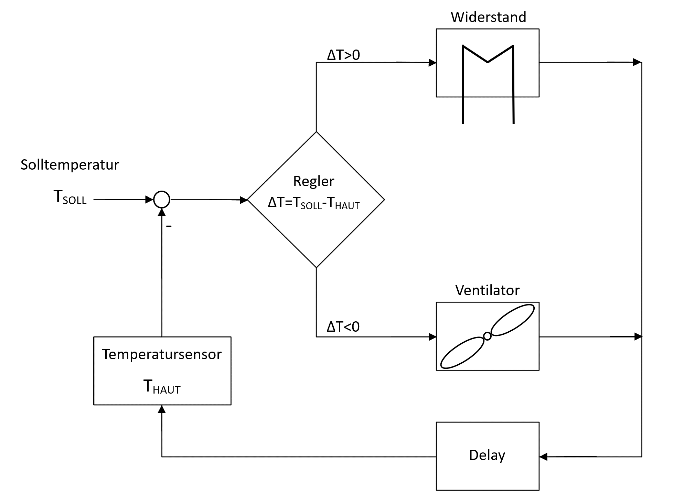

# Personal Temperature Controll Project

This repo describes the code for implementing a prototype for a 
personal climate system, which was implemented with a heating and
a cooling function. The body temperature of a person should be measured, 
and according to the temperature either a fan or a heat rod should be 
activated to controll the body temperature. The aim is to create a comfortable
temperature bubble for a working person infront of a desk, to save energy 
consumed by the HVAC system.

The concept was already proposed and prototyped in Arens and Zhang[2006]:

[comment]:#
- T_Target(german: T_Soll) can only be manual be changed. The adurino is capable to accept commands to change T_Target(german: T_Soll) and the PID reacts to this change
- both heating or cooling system react to changes of body temperature in changing their intensity, measured by the difference of bodytemperature T_Body(german:T_Haut) and T_Target(german: T_Soll)
- ideal body temperature lies around 37°Celsius

The following diagramm shows how the controller should react:

Theoretic cases to compute by the adurino:

[comment]:#
- Breadboard (german: Busleiste)

According to the controll loop in the chapter above, the tasks of the
components are represented as following:

The follow scheme was used for connecting the components:

The protoype looked as follows:

### Software

On the software side, we computed the adurino with C++. We used existing
libaries to connect the Arduino with sensors and for the PID controller. We 
developed a command parser for input commands over computer.

The following scripts were used for these cases:
- _windows_PID_heiz.ino_ was used for heating case
- _windows_PID_venti.ino_ was used for cooling case

These commands where implemented:
- setOffset _double_: change T_Target temperature
- ki _double_: change K_i or integral part of the PID controller
- kp _double_: change K_p or change the constant part of the PID controller

## Calibration and Tests

To calibrate the controller we had to set K_i and K_p manually. To find appropriate we conducted
a test to determine the [Step response][link1] of our system for heating and cooling case.

For the following values we recieved a ideal response for the heating case:

And for the cooling case:

In a livetest we generated good results for the cooling case with using the CPU fan:

For the heating case we couldnt replicate the results from the Step response test. There are also several downfalls
which we observed:

- There can be a discrepancy between mesured temperature and bodytemperature, because the sensor has to be glued to the body
- A solution with the cable sensor is very impractical. A better solution can be provided by using an infrared sensor
- The heating case was impractical because of the used hardware/heatrod. A better solution should be found here
- The environmental temperature influence isn't quite clear, but didn't had a strong inpact on the measurments 
- The fan distance is another unknown parameter, which has to be researched further 

## Sources

Arens, E., Zhang, H., 2006. The skin's role in human thermoregulation and comfort, in: N. Pan, P. Gibson (Eds.), Therm. Moisture Transp. Fibrous Mater., Wood- head Publishing Ltd, 560-602. 

## Credits
Project "Anwendungswerkstatt" in 2019 at RWTH Aachen E3D

By:

Yuhan Hu, Stephan Wegewitz, Evaluna Angelini, Shutong Li

[link1]: https://en.wikipedia.org/wiki/Step_response